# 问答题
一.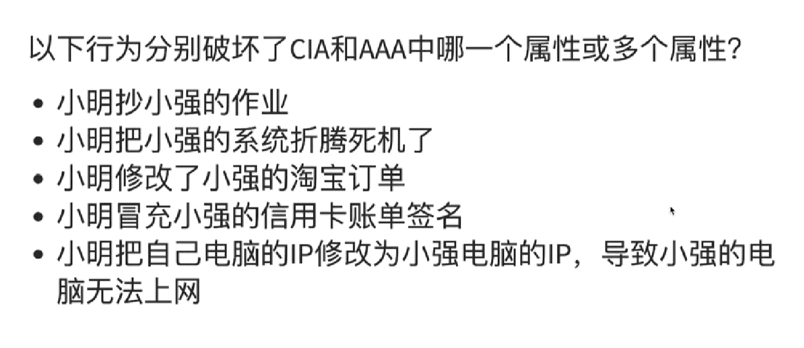
1.CIA 机密性
2.CIA 可用性
3.AAA 认证 授权 
4.AAA 认证 审计
5.CIA 可用性 AAA认证

二.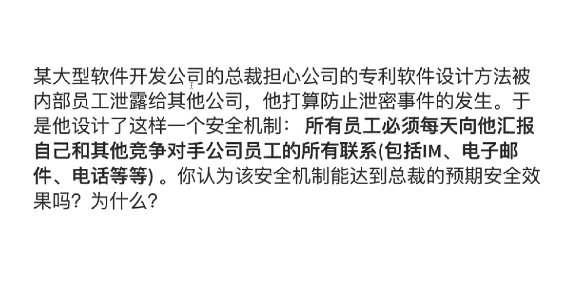
不能，因为不能完全操控员工，没办法保证员工提供的信息的真实性

三.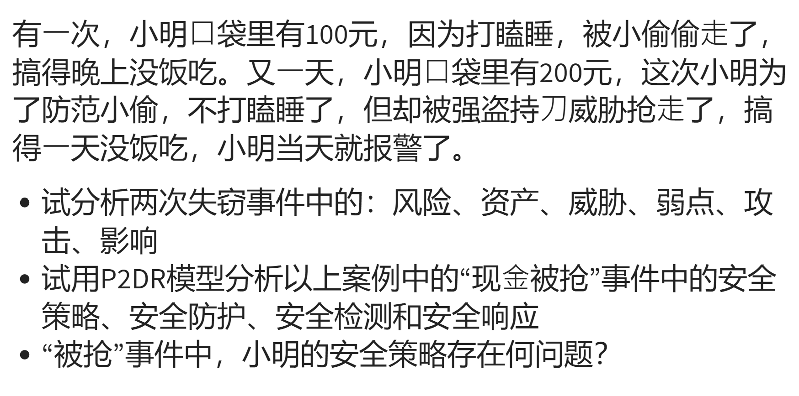
第一次：
风险：小偷
资产：100元
威胁：小偷
弱点：打瞌睡
攻击：偷
影响：没饭吃

第二次：
风险：小偷
资产：200元
威胁：刀
弱点：胆小
攻击：持刀抢劫
影响：没饭吃

四.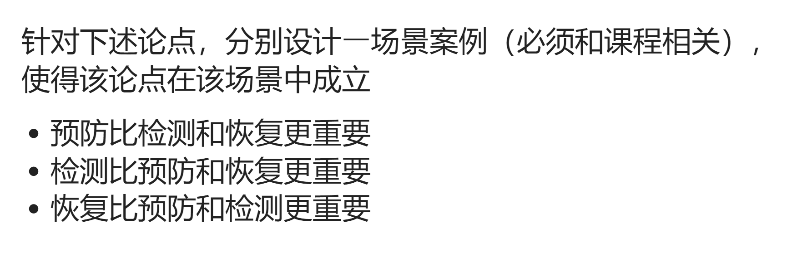
1. 西安健康宝因网络技术故障一个月内崩溃两次
2. APP 软件漏洞要定期检测
3. 数据备份

五.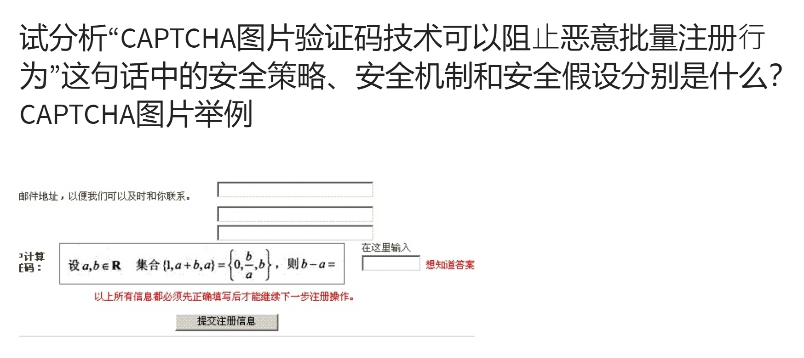
安全策略：机器没办法快速大量识别题目答案
安全机制：以预防为主
安全假设：机器不会识别题目

六.
经常使用：知乎 B站 百度 CSDN 畅课 学习通APP 淘宝APP 支付宝APP
学习通APP安全漏洞，造成1.7亿大学生信息泄露

# 实验：基于 VirtualBox 的网络攻防基础环境搭建

## 实验目的

1.掌握 VirtualBox 虚拟机的安装与使用；
2.掌握 VirtualBox 的虚拟网络类型和按需配置；
3.掌握 VirtualBox 的虚拟硬盘多重加载；

## 实验环境

VirtualBox 虚拟机
攻击者主机（Attacker）：Kali Rolling 2019.2
网关（Gateway, GW）：Debian Buster
靶机（Victim）：From Sqli to shell / xp-sp3 / Kali

## 实验内容

### 1.虚拟硬盘配置成多重加载,设置网关为4块网卡
打开虚拟机管理,进入虚拟介质管理,选中对应虚拟硬盘，改为多重加载，释放盘片后重新加载虚拟硬盘.效果如下图所示：
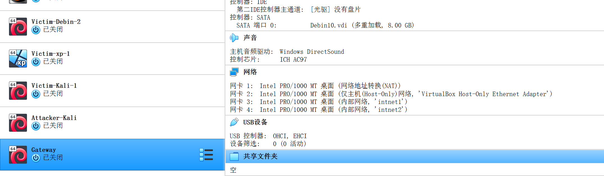

### 2.搭建满足如下拓扑图所示的虚拟机网络拓扑
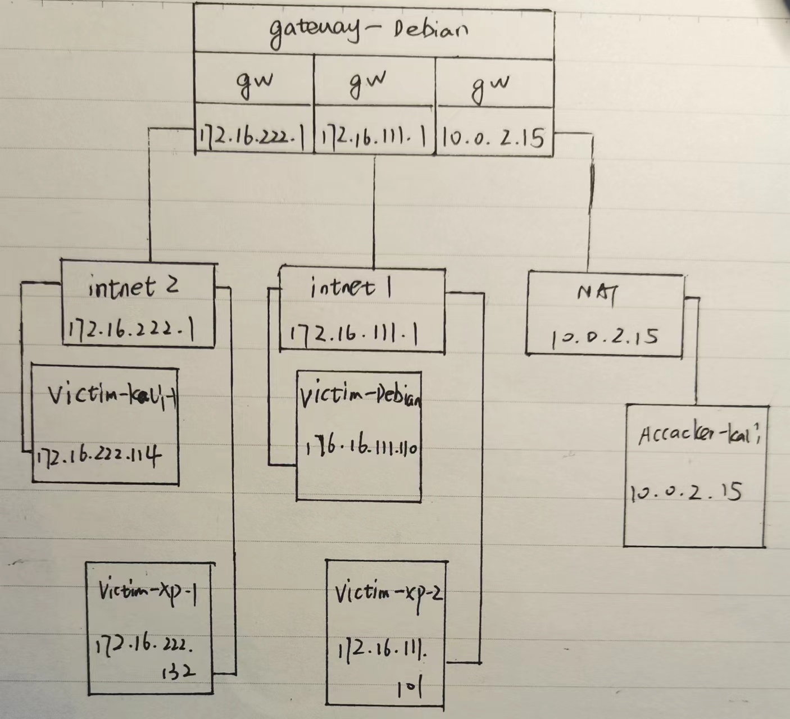

### 3.完成以下网络连通性测试

[1] 靶机可以直接访问攻击者主机：
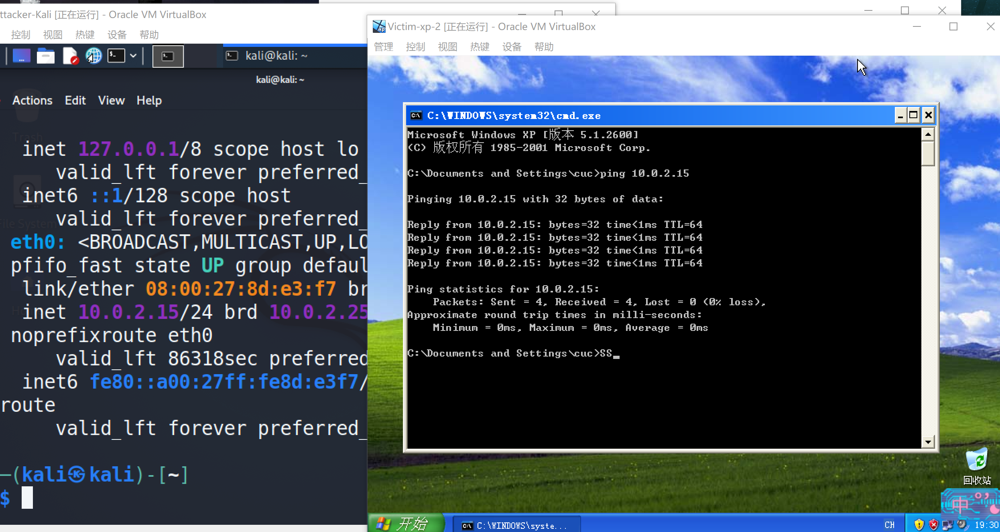

[2] 攻击者主机无法直接访问靶机
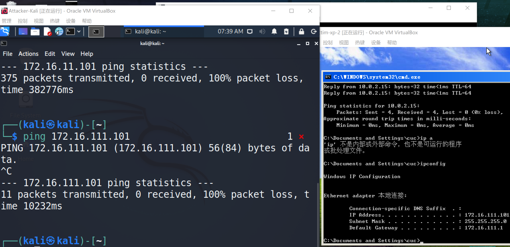

[3] 网关可以直接访问攻击者主机和靶机
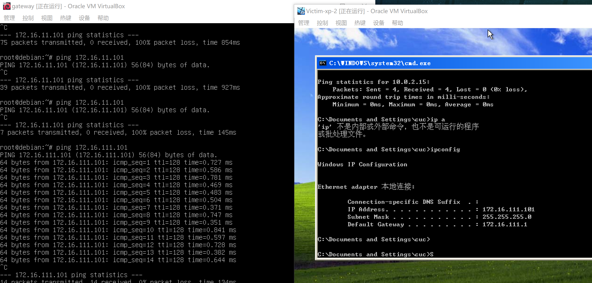

[4] 靶机的所有对外上下行流量必须经过网关
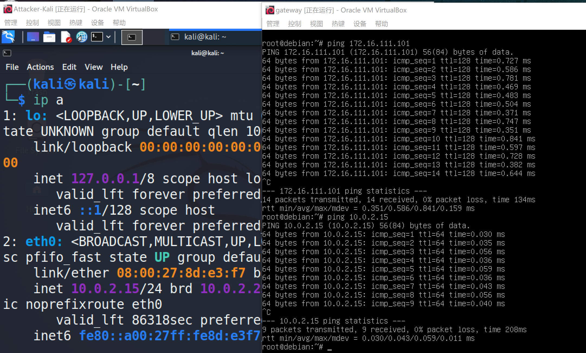

[5] 所有节点均可以访问互联网
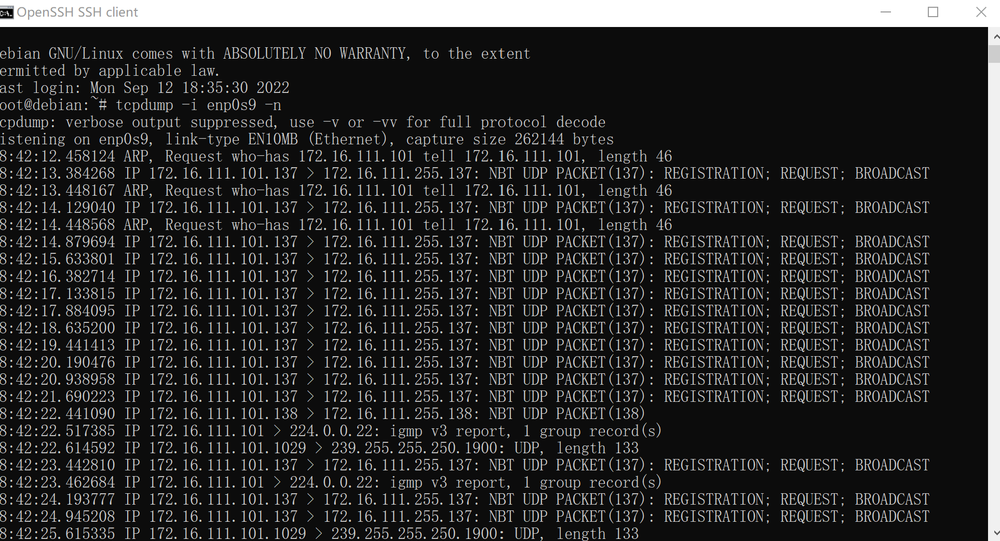

## 实验反思
1.使用内部网络的电脑想运行，一定要打开网关，gateway 不打开全都 ping 不通；

2.网关无法访问 xp 系统是因为防火墙的原因，关闭防火墙之后可以正常访问；

3.xp 系统中无法使用 ip a 命令，可以用 ipconfig 查询地址；
