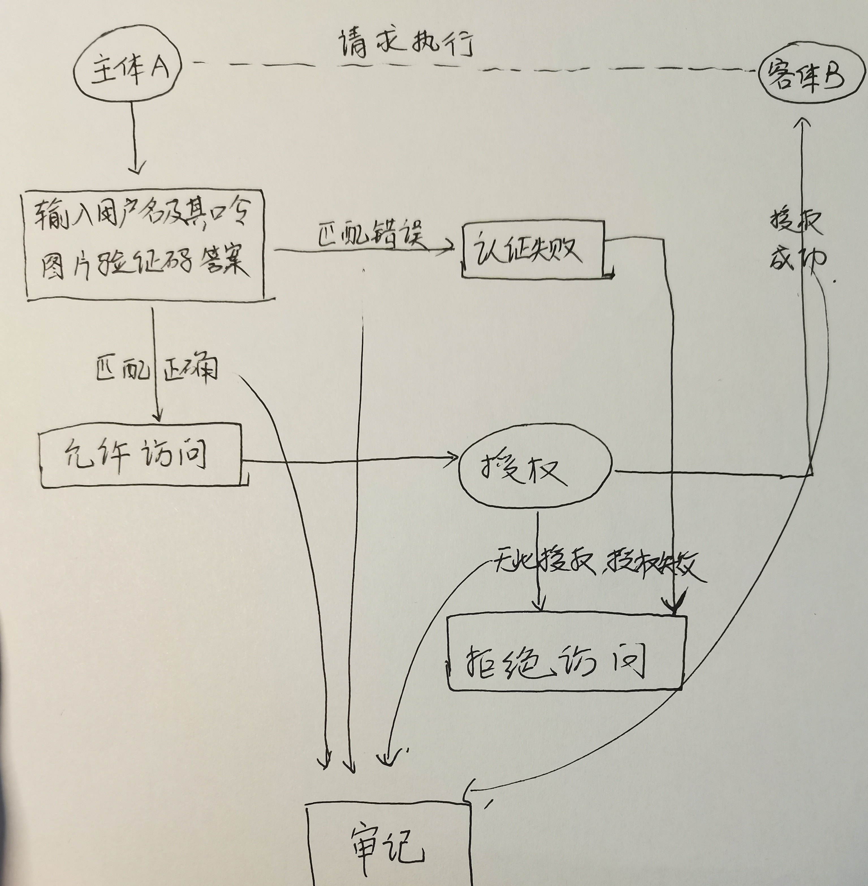

### 1．生物特征身份认证方式有哪些？优缺点分析？应用场景举例。
指纹 
优点：便捷 速度快 易操作
缺点：容易复制，安全性低
身份证办理需要识别指纹

人脸 
优点：成本低，易于推广
缺点：3D打印可以伪造
手机锁屏

虹膜
优点：准确，难复刻
缺点：虹膜识别硬件造价较高，大范围推广困难
政府机关门禁

### 2．“找回口令功能” 和 “忘记密码” 在访问授权机制中的意义？请尝试设计几种安全的 “找回口令功能” ，详细描述找回口令的用户目体操作过程。
访问授权机制中，授权主体对客体可以正常访问，非授权主体对客体无法访问。
设计 “找回口令功能” 和 “忘记密码” 的功能是为了防止授权主体在忘记口令的情况下还能继续找回口令，不至于无法访问。
 “找回口令功能” 详细操作过程：
在初始设计口令时可以设计让用户填下关于他的私人问题，除了他之外很少人知道的问题，如：“你的初中班主任的名字” “你最喜欢的异性的名字等” ，在找回口令或者忘记密码的时候就可以通过对这些问题来合适人员是否为主体。

### 3.绘制用户使用用户名／口令＋图片验证码方式录系统的流程图。考虑认证成功和失败两种场景，考虑授权成功和失败两种场景。

### 4.Windows XP /7中的访问控制策略有哪些？访问控制机制有哪些？
常见五种访问控制策略：
1：自主型访问控制（Discretionary Access Control -DAC）:用户/对象来决定访问控制权限。信息的所有者来决定谁有权利来访问信息以及操作类型（读，写，执行。。。）。是一种基于身份的访问控制。例如UNIX权限管理

2：强制性访问控制（Mandatory Access Controll -MAC）：系统来决定访问权限。安全属性是强制型的规定，它由安全管理员或操作系统根据限定的规则确定的，是一种规则的访问控制。

3：基于角色的访问控制（RABC）:角色决定权限。用组织角色来同意或拒绝访问。

4：规则驱动的基于角色的访问控制：提供了一种基于约束的访问控制。

5：基于属性证书的访问控制：访问权限信息存放在用户属性证书的权限属性中，每个权限属性描述了一个或多个用户的访问权限。当用户对某一个资源提出访问请求时，系统根据用户的属性证书中的权限来判断是否允许。

常见访问控制机制：DAC、role-BAC、rule-BAC、MAC

### 5．用权限三角形模型来理解并描述下2种威胁模型：提权、仿冒。
认证 授权 审计

提权：当攻击者能够获得他们通常不具有的权限时，就会发生特权提升威胁。经典缓冲区溢出如此重要的原因之一是，它们通常允许攻击者提高其权限级别 - 例如，任何面向 Internet 的组件中的缓冲区溢出都允许攻击者将其权限级别从匿名用户提升到本地用户。

仿冒：当攻击者假装成他们不是的人时，就会发生欺骗攻击。因此，使用DNS劫持并假装 www.microsoft.com 的攻击者将是“欺骗”攻击的一个例子。欺骗攻击可能发生在本地。例如，正如我在 “重新应用贴花” 中提到的，贴花插件框架将自己注入到 Asheron 的调用过程中的一种机制是欺骗 Asheron 的调用使用的 COM 对象之一。

### 6．试通过操作系统的访问控制机制来达到预防一种真实病毒的运行目的。
操作系统的访问控制机制包括： 认证和授权机制 访问检查机制 对象重用机制 审计和可信通信机制。
首先在病毒初步被下载到电脑中的时候，它没有经过认证授权，就无法运行，通过访问检查机制，可以查询到恶意代码病毒，提供提醒，引起用户注意。

### 7．什么是 OAuth ?
oAuth是Open Authorization的简写。
AUTH 协议为用户资源的授权提供了一个安全的、开放而又简易的标准。与以往的授权方式不同之处是 OAUTH 的授权不会使第三方触及到用户的帐号信息（如用户名与密码），即第三方无需使用用户的用户名与密码就可以申请获得该用户资源的授权，因此 OAUTH 是安全的。

### 8．什么是 OpenID ?
OpenID 是一个以用户为中心的数字身份识别框架，它具有开放、分散性。OpenID 的创建基于这样一个概念：我们可以通过 URI （又叫 URL 或网站地址）来认证一个网站的唯一身份，同理，我们也可以通过这种方式来作为用户的身份认证。

### 9．试用本章所学理论分析 OAuth 和 OpenID 的区别与联系。
OAuth 关注的是 authorization 授权，即：“用户能做什么”； 
而 OpenID 侧重的是 authentication 认证，即：“用户是谁”。

### 10．如何使用 OAuth 和 OpenID 相关技术实现单点登录（ Single Sign On )?

参考链接：
https://zhuanlan.zhihu.com/p/391694381
https://blog.csdn.net/AIfurture/article/details/100042214
