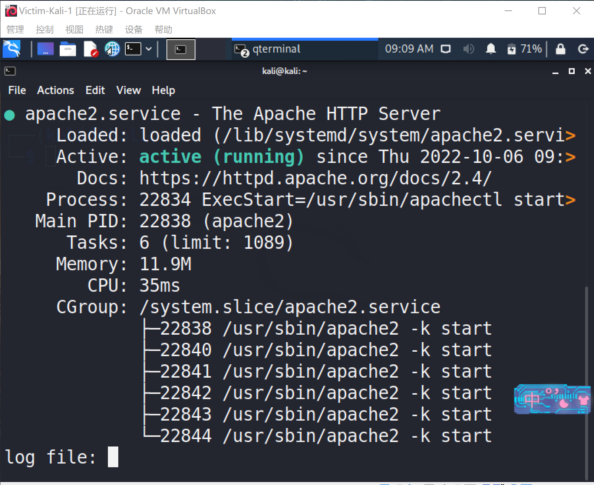
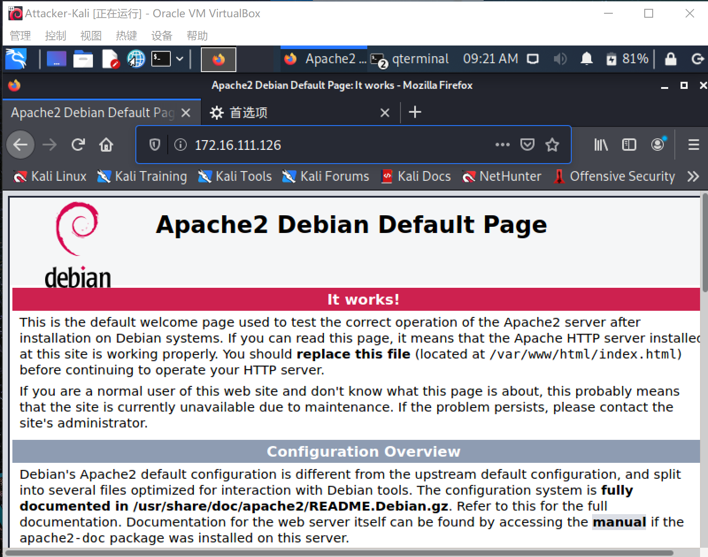
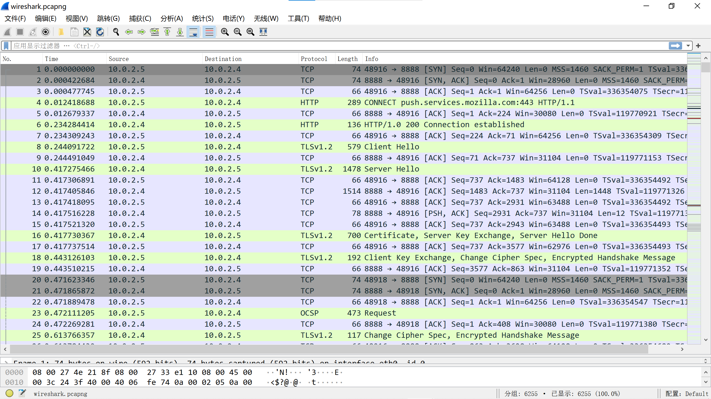
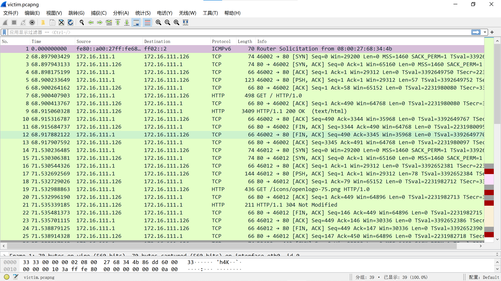

# HTTP代理服务器实验

1.Q：使用http代理服务器访问HTTPS站点时，通信传输内容是否会被代理服务器“看到”？

A：结论是代理服务器不知道客户端和服务器的HTTPS通信内容，但代理服务器知道客户端访问了哪个HTTPS站点，这是由http代理的协议机制决定的：代理客户端会发送Connect请求到http代理服务器。

实验验证：在Kali Linux中安装tinyproxy，然后用主机设置浏览器代理指向tinyproxy建立的HTTP正向代理，在Kali中用wireshark抓包，分析抓包过程，理解HTTP正向代理HTTPS流量的特点。

### 实验过程：
未开启apache前， 靶机对攻击者的HTTP请求没有响应 ，此时由于web服务器还未开启
开启apache以后靶机可以通过浏览器访问攻击者
攻击者还是无法访问靶机，接下来使用正向代理 tinyproxy

- apt update && apt-get install tinyproxy //安装tinyproxy
- sudo apt-get install gedit //为使用gedit命令，即编辑配置文件
- vi /etc/tinyproxy/tinyproxy.conf  //编辑配置文件
- service tinyproxy start //开启tinyproxy

配置文件允许该网段使用本网关为代理，10.0.0.0/8设置为allow，注意:linux中:wq是保存并退出
攻击者配置代理，网关设为代理，端口设为默认值8888
配置完成后，攻击者在浏览器对靶机进行访问，同时在靶机上抓包

### 实验截图

攻击者访问靶机的apache，同时让靶机进行抓包，访问两个地址分别为:172.16.111.133和172.16.111.133/nationalday，分别出现apache界面和404

查看抓包结果,由于本次实验只关心http协议，所以过滤后剩下以下信息

